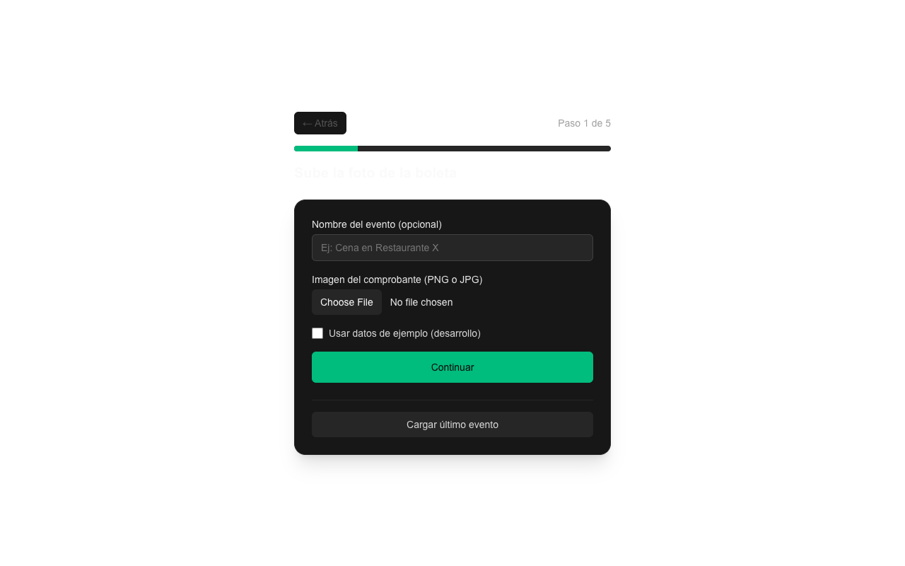

<p align="center">
  <b>🧾 Project Tacuen</b><br>
  <sub>Digitalizá boletas y repartí gastos entre personas — con IA para leer los tickets y exportación a Excel.</sub>
</p>

<p align="center">
  
</p>

<p align="center">
  
  
  
  
</p>

---

## Qué hace

Subís la foto de una **boleta o ticket**, la IA (OpenAI) extrae los ítems y los precios, repartís el gasto entre las personas que participaron y exportás el reparto a **Excel**. Ideal para dividir la cuenta de un grupo.

## Funcionalidades

- **Subir boletas** (foto) con validación de tipo y tamaño (`MAX_RECEIPT_MB`).
- **Análisis de tickets con IA**: OpenAI extrae ítems y totales de la boleta.
- **Repartir gastos** entre personas (split).
- **Exportar a Excel** (`.xlsx`) el resumen del reparto.
- Persistencia en **Supabase** (base de datos + almacenamiento de imágenes).
- Feedback y analítica de uso.

## Uso local

1. Instalar dependencias:

```bash
npm install
```

2. Configurar variables de entorno (`.env`):

| Variable | Uso |
|----------|-----|
| `NEXT_PUBLIC_SUPABASE_URL` | URL del proyecto Supabase |
| `SUPABASE_SERVICE_ROLE_KEY` | Clave de servicio (solo servidor) |
| `SUPABASE_STORAGE_BUCKET` | Bucket para las imágenes de boletas |
| `OPENAI_API_KEY` | Clave de OpenAI para analizar tickets |
| `MAX_RECEIPT_MB` | Tamaño máximo de subida (defecto 10) |

3. Levantar la app:

```bash
npm run dev      # http://localhost:3000
```

## Tecnologías

| Capa | Stack |
|------|-------|
| Framework | Next.js 16 (App Router) |
| Base de datos | Supabase (Postgres) |
| Almacenamiento | Supabase Storage |
| IA | OpenAI |
| Export | ExcelJS (`.xlsx`) |

---

<p align="center"><sub>Hecho con ❤️ por <a href="https://github.com/anthoniriv">Anthoni Rivera</a></sub></p>
